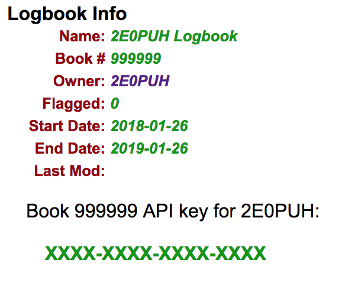

# 2E0PUH's log upload tools

This repo contains scripts for uploading log files to various online logbooks.

Contents:

* `bin/qrz_upload` -- https://www.qrz.com ADIF uploader
* `bin/qth_upload` -- https://hamqth.com uploader

## qrz_upload

`qrz_upload` has two modes of operation. The first, `--check` is designed to
let you check that your logbook's API key works, and the second uploads data.

I won't be held responsible to any problems with your logbooks, so please test
everything using a secondary logbook on qrz.com before building this into your
workflows.

### dependencies

I've tried to keep this script's dependencies to a minimum, but to run this
you'll need:

* Data::Dump
* Ham::ADIF
* Pod::Usage
* LWP::UserAgent
* URI::Encode

On a Mac you should be able to install all of these by running:

        cpanm Data::Dump Pod::Usage LWP::UserAgent URI::Encode

On Linux these will probably all be packaged or are available from CPAN.

### check mode

To find the key for your log, visit: http://logbook.qrz.com/logbook, and look
on the settings pane on the left. The key is the 16 character code on the
bottom of the pane.

To test it works, run:

        % ./bin/qrz_upload --key=XXXX-XXXX-XXXX-XXXX --check

And if it does, you'll see something like this:

        Key OK. Dumping status info
        {
          ACTION     => "STATUS",
          BOOK_NAME  => "2E0PUH/TEST Logbook",
          BOOKID     => 999999,
          CALLSIGN   => "2E0PUH_TEST",
          CONFIRMED  => 0,
          COUNT      => 2,
          DXCC_COUNT => 1,
          END_DATE   => "2029-04-01",
          OWNER      => "2E0PUH",
          RESULT     => "OK",
          START_DATE => "2014-04-01",
        }

If the key is incorrect, you'll see:

        Problem with key: invalid api key XXXXXXXXXXXXXXXX

If this happens, check you have the key correct and try again.

When you are confident you have the key correct, you can move to uploading.

### upload mode

Upload mode requires little more input than check mode. This is because all
entries you upload to qrz.com must have a `station callsign` entry. 
My logging software of choice [RUMLogNG](http://www.dl2rum.de/rumsoft/RUMLog.html)
does not include station callsigns in its exported ADIF data, so my
script must add them. As a result you must currently specify the callsign on
the command line in addition to the API key, and the callsign must match the
one in your log's settings.

To upload ADIF data, run:

        % ./bin/qrz_upload --adif upload.adif --key=XXXX-XXXX-XXXX-XXXX-XXXX --callsign='callsign'

All being well, you should see something like:

        Completed. OK: 2 FAIL: 0

If there are problems, you will see something like:

        Completed. OK: 1 FAIL: 1
        Saw the following failures:
         * 1 of 'Unable to add QSO to database: duplicate'

As this is vary common during log uploads, the script doesn't currently log
which entries were problematic. To get more information on problems, rerun with
the `--verbose` flag, in order to be shown which line in the ADIF file couldn't
be uploaded:

        Line 11: Unable to add QSO to database: duplicate
        Line 12: Unable to add QSO to database: duplicate
        Completed. OK: 0 FAIL: 2
        Saw the following failures:
         * 2 of 'Unable to add QSO to database: duplicate'

### other arguments

Run `qrz_upload` with `--help` or `--man` for more options.

### caveats

`qrz_upload` assumes that a logged QSO only occupies one line in the ADIF file.
I'm not 100% sure that this is always the case!

API uploads may only work for paid qrz.com members, I'm not sure as I have paid
for XML logging.
